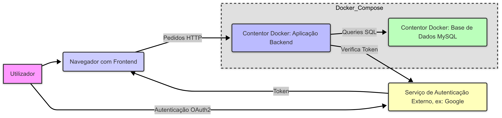

# Capitulo 3 : Produto

Descrição do desenvolvimento, instalação e utilização do produto_

## 3.1 Desenvolvimento

O sistema foi desenvolvido como uma aplicação web completa (full-stack), tendo como principal objetivo gerir agendamentos de consultas entre pacientes e médicos. A arquitetura é composta por duas partes principais: um frontend, responsável pela interface do utilizador, e um backend no formato de API RESTful, que centraliza toda a lógica de negócio.

- Frontend (Interface do Utilizador):

  - Desenvolvido como uma Single-Page Application (SPA) utilizando a biblioteca React. É responsável por fornecer uma experiência de utilizador interativa e reativa, consumindo os dados fornecidos pelo backend.

- Backend (API):

  - A API foi projetada seguindo o padrão RESTful e documentada com OpenAPI 3.0. Segue uma arquitetura baseada em camadas, com separação clara entre autenticação, lógica de negócio e acesso a dados.

### Tecnologias principais:
- **Node.js / Express** (servidor backend)
- **React** (Frontend)
- **JWT** para autenticação
- **Swagger** para documentação da API
- **Base de dados relacional** (ex: PostgreSQL ou MySQL)

### Diagrama da Arquitetura do Sistema

## 3.2 Instalação

O projeto está dividido em duas pastas principais: uma para o backend (API) e outra para o frontend (React). A instalação deve ser feita para ambas as partes.

### Pré-requisitos

- Node.js 18+ instalado
- Mysql
- `npm` para instalar dependências

### Passos de instalação

1. **Clonar o repositório**

- git clone [[https://github.com/inf23dw2g33/M2.git](https://github.com/inf24dw2g33/M2.git)]

2. **Instalação dependências**

- npm install

## 3.3 Utilização

### Utilização da Aplicação Web

A principal forma de interagir com o sistema é através da interface web. Após iniciar os servidores do backend e do frontend, aceda ao endereço do frontend (http://localhost:80) no seu navegador. A partir daí, poderá criar uma conta, fazer login, visualizar médicos/especialidades e gerir as suas consultas.

### Utilização Direta da API (para Testes/Desenvolvimento)

É possível interagir diretamente com a API para fins de teste.

### Autenticação

- Todos os endpoints protegidos requerem autenticação via JWT. Após login, o token será enviado no cabeçalho das requisições.

### Exemplo de requisição autenticada

- curl -H "Authorization: Bearer <token>" http://localhost:3000/users/1/appointments

## 4 Limitações e notas

- Apenas utilizadores autenticados podem aceder a recursos protegidos.
- Algumas rotas exigem permissões de administrador (ex: criar especialidades).
- A API retorna mensagens de erro informativas com códigos HTTP padronizados (401, 403, 404, 500, etc.).
